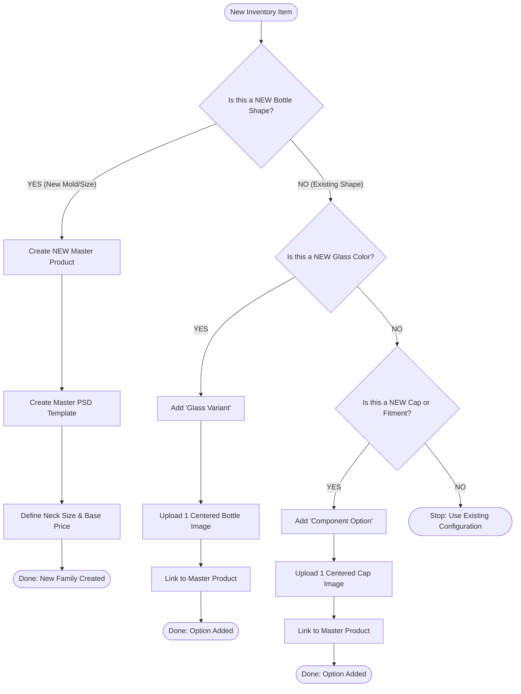

# Best Bottles: Product Organization Strategy

## 1. The Core Philosophy
To maintain a scalable catalog, we organize products by **Geometry (Shape)**, not by Color or Configuration.

> **"One Shape = One Master Product"**

*   **DON'T DO THIS:** Create separate products for "Blue Roller", "Blue Sprayer", "Clear Roller".
*   **DO THIS:** Create one "5ml Cylinder Collection" that contains Blue, Clear, Roller, and Sprayer as *selectable options*.

---

## 2. The Decision Tree

Use this flowchart when adding new inventory to the system:

---

## 3. Practical Examples

### Case A: "10ml Square Bottle" (New Shape)
*   **Decision:** This shape does not exist in the system.
*   **Action:** Create **"10ml Square Collection"**.
*   **Asset Work:** Create 1 Master PSD for the 10ml Square shape.

### Case B: "5ml Cylinder in Frosted Glass" (Existing Shape)
*   **Decision:** We already have a "5ml Cylinder".
*   **Action:** Go to the **5ml Cylinder** product and add "Frosted" to the **Glass Options** list.
*   **Asset Work:** Upload 1 image of the Frosted Bottle (using the 5ml Master Template).

### Case C: "Wood Grain Cap" (New Accessory)
*   **Decision:** This cap works on *any* bottle with an 18/415 neck.
*   **Action:** Create a **"Wood Cap"** option in the Global Cap Library.
*   **Asset Work:** Upload 1 image of the Wood Cap aligned for the 5ml Cylinder. (If you add the 10ml Square later, you will add a 10ml-aligned image to this same Cap option).

---

## 4. Why This Matters for Clients
1.  **Reduced Data Entry:** Instead of managing 600 SKUs, you manage ~20 Product Families.
2.  **Visual Perfection:** By grouping by shape, we ensure the "Paper Doll" alignment is always perfect for that specific geometry.
3.  **Better User Experience:** Customers prefer to land on one page and customize their bottle, rather than clicking back and forth between "Blue Bottle" and "Amber Bottle" pages.
